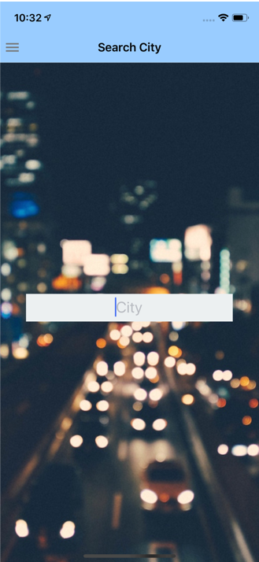

# Overview

The Weather App demonstrates the skills learned from the summer course **Mobile App Development Using Rect Native**

# Features

The application allows a user to view the current weather of his/her own location. The user search for the info of the weather in a diffrent cities.

The application uses the API from [OpenWeatherMap](https://openweathermap.org/)

 

# Requirements

The app requires node 12.9.0

